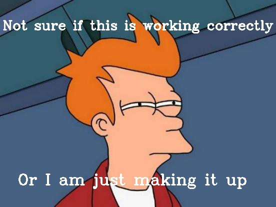
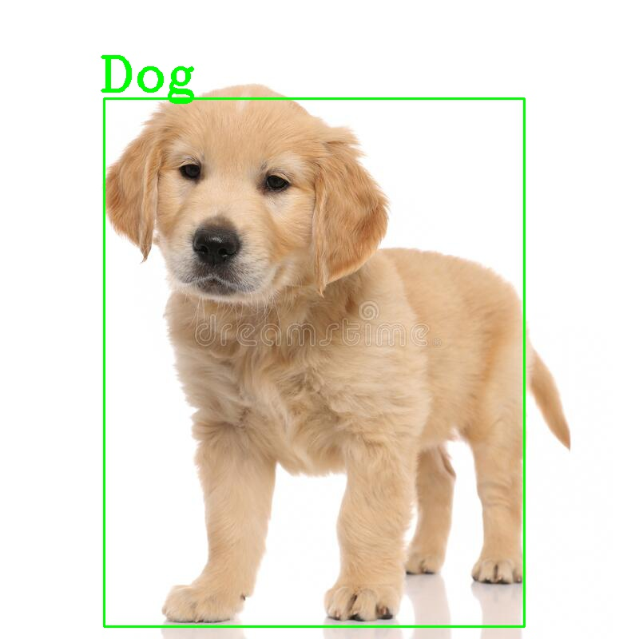
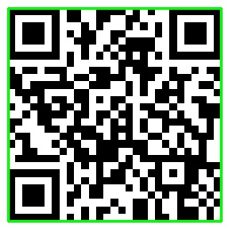
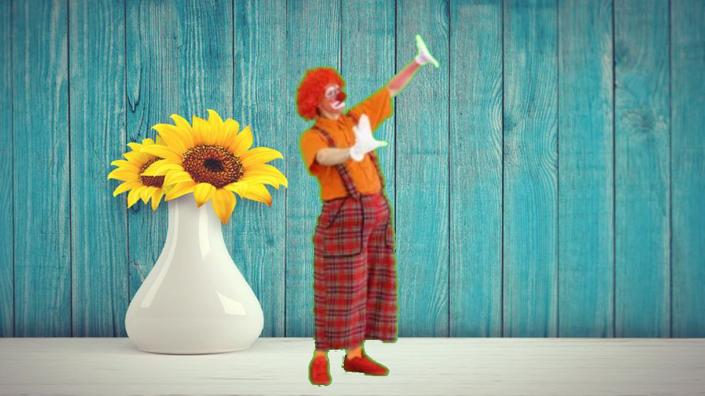

# opencv_projects
The repository contains mini projects done using OpenCV library in Computer Vision

Necessary packages to run this project:

--------------------------------------------------------------------------------
LIBRARY		|    VERSION	|  ANACONDA INSTALLATION 
----------------|---------------|-----------------------------------------------
Python 		|     3.8	|         	
matplotlib 	|    3.5.1	|  conda install -c conda-forge matplotlib 	
opencv 		|    4.5.5	|  conda install -c pytorch pytorch 
numpy   	|    1.22.3	|  conda install numpy
torch 		|    1.11.0	|  conda install -c pytorch pytorch 
torchvision	|    0.12.0	|  conda install -c conda-forge torchvision
-------------------------------------------------------------------------------

1. Meme generator. 

This project takes an image and text to write on the image and returns an image with the written text on it. 

Instructions on how to run it: open meme_gen.ipynb file, run the function with the necessary parameters and it will save an image with the name meme.jpg to the same directory. 

2. Image annotation
This function takes an image, a text to annotate, and path to save the model and returns the image with found biggest counter and drawn rectangle around it with an input text and saves it. 

Instructions on how to run it: open image_annot.ipynb file, run the function with necessary parameters.

3. QR Code detector

This function takes an image with QR code and path to save the file. It reads the image, draws a rectangle around the first contour and saves it to the specified path.

Instructions to run it: open the qr.py file and run the function with necessary input parameters.

4. Green screen changer

This function changes the green background of (or any color, it can be changed easily) images to a selected background. 

Instructions to run it: open the green.ipynb file and run the merge_green function with necessary parameters: path to the object picture, path to background picture, and path to save the image. 

